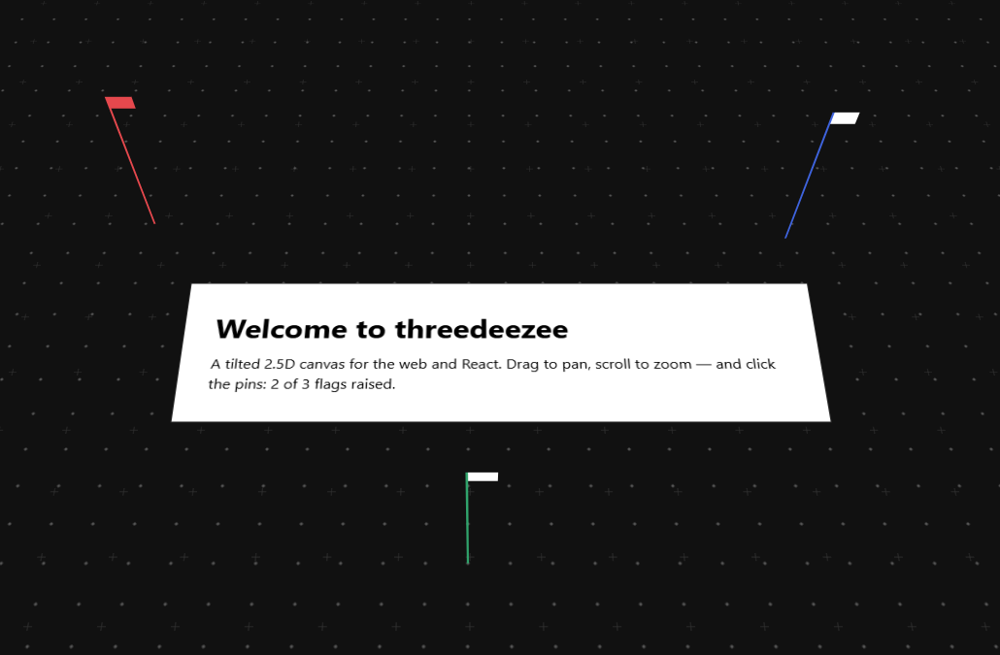

# ThreeDeeZee

_Component library for creating 3D Zooming UIs. Half design and half framework, these components add depth and a new level of physicality to your website by displaying things as a 2.5D tilted perspective. Giving the perspective of viewing a physical 3D surface and bringing new life to your flat interfaces!_

Built using [GSAP](https://gsap.com) animation library and typescript while intentionally kept light and flexible. Supporting React Components and Web Components.

## Features

- Click n' Drag panning
- Scrolling and zooooming
- Draggable and static panels
- Z-Index Flag/Pins
- Parallax surfaces emphasize depth

**Check it out!**

## Commands

_Replace the `*` with `dev` or `build` to construct those examples._

- Use Storybook via `pnpm storybook` to view stories
- Check out the different framework examples
  - Raw JS and HTML via `pnpm example:html:*`
  - React components `pnpm example:react:*`
  - Web Components with Lit `pnpm example:lit:*`

## Documents

Licensed under the [Apache License 2.0](LICENSE).
See the [AI Policy](AI_POLICY.md).

_[Human written. AI Agents Do Not Interact.]_
